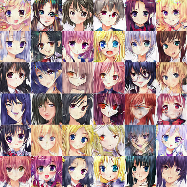

# GANime
A generative adversarial network for generating anime face images

## Examples
36 random samples. [More here](proj/2_pipeline/1_anime_GAN_sampling/out/raw_samples/)

### Interpolations

## Data
Images originally from [here](https://github.com/Mckinsey666/Anime-Face-Dataset)
